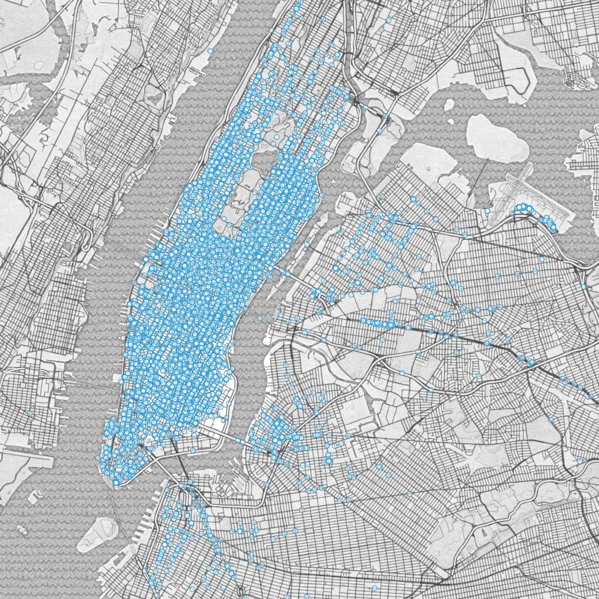
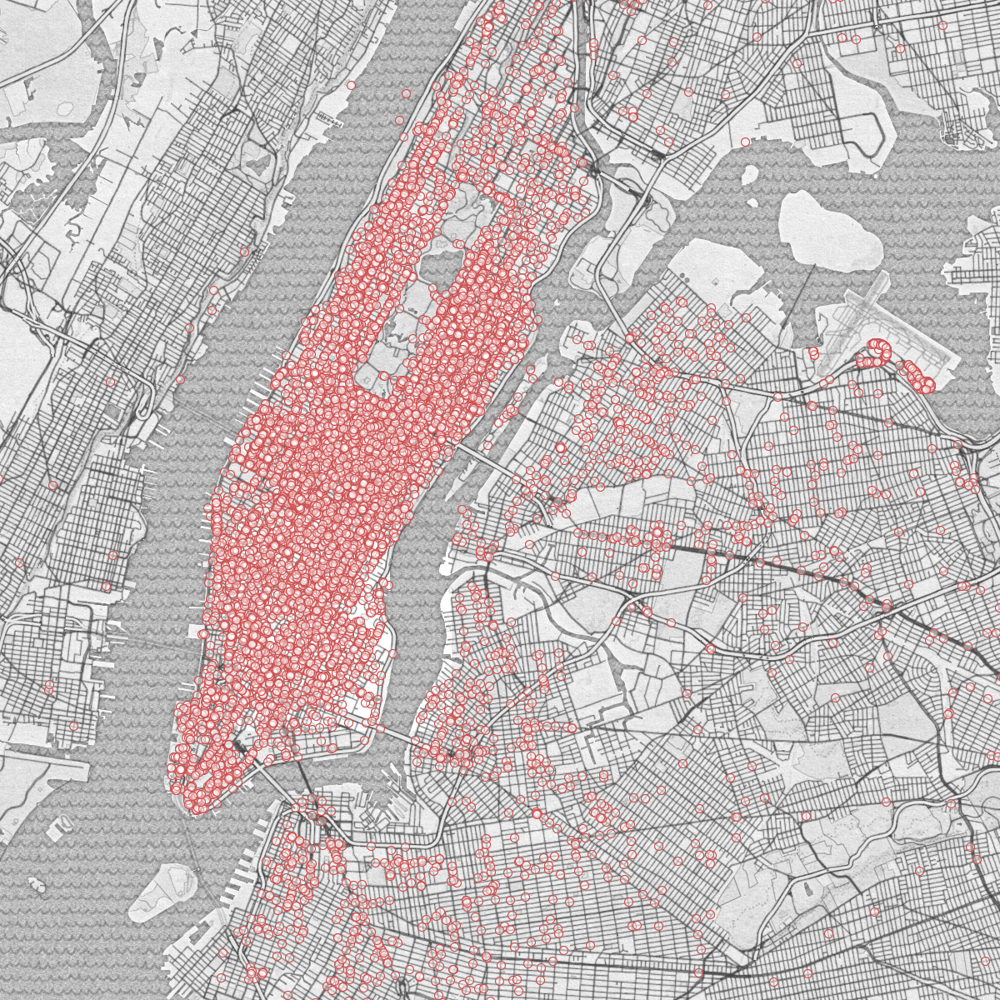

# 4D Density Maps: A view into Manhattan taxis
===============

Transportation is a big industry (how big?). It's becoming more competative (Who are the players? Uber, Lyft?). Technology is deciding the winners (Software eats the world).

Wong releases FOIL data. [[Wong 2014]]. People visualize [[A Day in the Life]]

Given a dataset of transportation pickups and dropoffs, one of the most natural questions is "Where is everybody going?" But this is a question with many answers, each of which answer a slightly different variation of the question and tells a slightly different story. The simplest way of framing and answering this question is as "Where is everybody coming from? Where is everybody going?". We can answer this question by simply plotting every pickup and dropoff on a map. Figure 1a shows the first 10k pickups, 1b shows the first 10k dropoffs.

</img>
</img>

[pickups]: ./img/pencil_pickups_10000.png "Taxi pickups"
[dropoffs]: ./img/pencil_dropoffs_10000.png "Taxi dropoffs" 

[Wong 2014]: http://chriswhong.com/open-data/foil_nyc_taxi/
[A Day in the Life]: (http://nyctaxi.herokuapp.com/)]